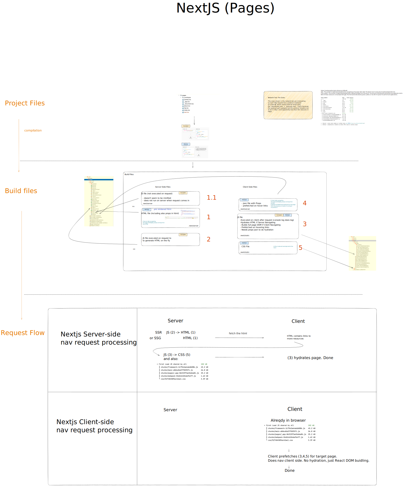

# Nextjs under the hood

If you are looking to understand how Nextjs takes your project files, processes them and then how exactly these files
are used and sent to the browser, this repo is for you.

I made this a while ago when I had the same curiosity. Currently, I only have it for the Pages Router but I'll add the
App router soon.

**Contributions to this repo would be welcome!**

## Pages

To edit this diagram download [this file](nextjs-under-the-hood.excalidraw) and got to [https://excalidraw.com/](https://excalidraw.com/)

## App Router

Coming soon.

